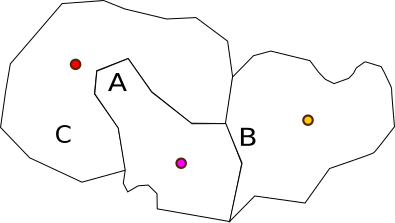
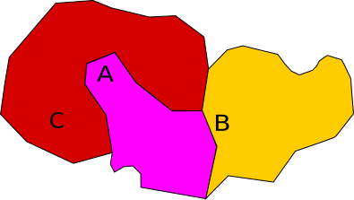

# OSM Reverse GEO Lookup

Generate a filtered down database from OSM data that can be used for reverse geo lookups.

Going from just a single coordinate (latitude, longitude) to a area can be heavy to calculate. The most simple solution is to build a database of locations and then look for the closest known spot. The problem is that an area is not well defined by a single location, so let's assume we pick the city center as our location. Consider the example below. We have three cities close together. From left to right. City Red, City Purple and City Yellow. Location A is clearly inside the borders of city purple, but it's physically closer to the Red cities center so this simple algorithm will place A in the incorrect city.



The database this project generates stores the areas as polygons (a sequence of coordinates). Instead of looking if A is closer to a specific location, it will just check if A is inside a polygon. This algorithm will correctly classify A as part of the purple city.



This is *much slower*, so note this if preformanse is important for you. We are talking about 600ms to query the database in a city in Sweden. This is with a really simple implementation. 

## Query the database

The database consists of a list of polygons. To find a match for a point (latitude and longitude) you need to walk through the entire file. The file if JSON-formated and looks like this:

```json
[
    [ "Red City",    [ [lat, lng], [lat, lng], ... ] ],
    [ "Purple City", [ [lat, lng], [lat, lng], ... ] ],
    [ "Yellow City", [ [lat, lng], [lat, lng], ... ] ]
]
```

There is a simple implementation in python called `query_db.py`, example usage:

```sh
python query_db.py 59.2771080105117 17.990112304687504
Stockholms kommun
```

## License

* The code is licensed under the MIT License.
* The database-files are licensed under [Open Data Commons Open Database License (ODbL)](https://opendatacommons.org/licenses/odbl/)
